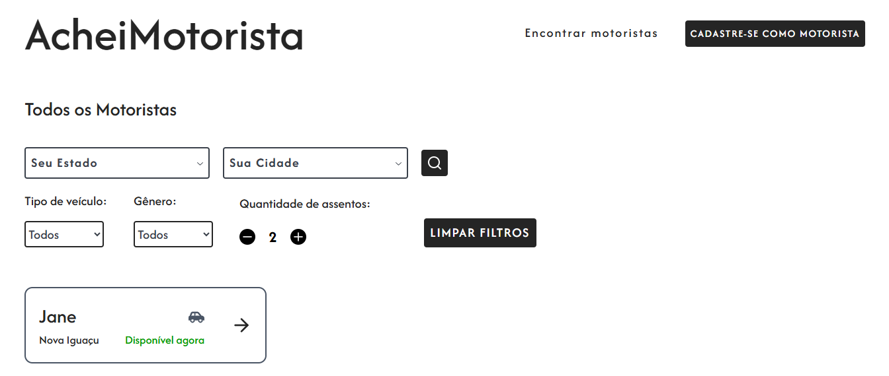

# AcheiMotorista

> AcheiMotorista é uma plataforma para conectar passageiros a motoristas independentes em suas cidades. O objetivo é facilitar o contato direto — permitindo que usuários encontrem motoristas por localização, tipo de veículo, disponibilidade e muito mais.

---

## Funcionalidades

- Busca de Motoristas
- Cadastro de Motoristas
- Perfil do Motorista
- Integração com Contato

---

## 🏗️ Tecnologias Utilizadas

### **Frontend**

- Next.js (React)
- TypeScript
- TailwindCSS
- Axios

### **Backend (CMS)**

- Strapi
- PostgreSQL

#### Deploy: https://achei-motorista-app.vercel.app/

#### Projeto pessoal para portfólio e prática de desenvolvimento full-stack.
